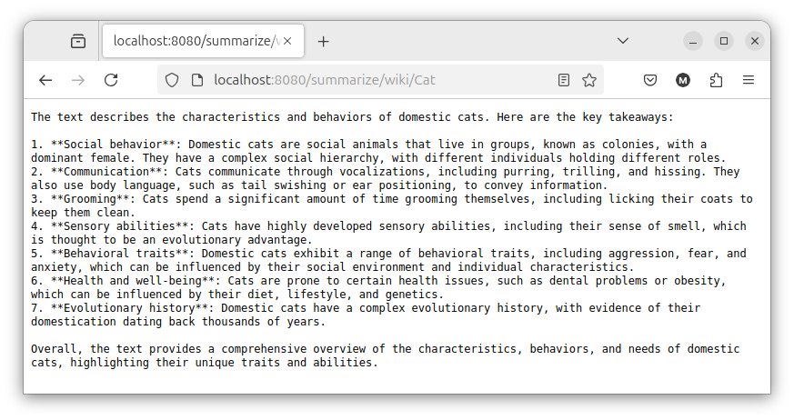

# A pure Java LLM-based application

The purpose of this project is demonstrating how [Quarkus](https://quarkus.io/), [Langchain4j](https://docs.langchain4j.dev/) and [Jlama](https://github.com/tjake/Jlama) make straightforward to create a pure Java LLM infused application, where the LLM inference is directly embedded in the same JVM running the application, without the need of any external service. 

[](https://raw.githubusercontent.com/mariofusco/site-summarizer/main/images/summarization_video.mp4)

Out-of-the-box this project uses a [small Llama-3.2 model with 4-bit quantization](https://huggingface.co/tjake/Llama-3.2-1B-Instruct-JQ4). When the application is compiled for the first time the model is automatically downloaded locally by Jlama from the Huggingface repository. However it is possible to replace this model and experimenting with any other one by simply editing the `quarkus.langchain4j.jlama.chat-model.model-name` property in the `application.properties` file.  

## The site summarizer

This project uses a LLM to automatically generate the summarization of a blog post taken from any website. After having compiled and packaged it with `mvn clean package`, the simplest way to use it is launching the jar passing as argument the URL of the web page containing the article that you want to summarize, something like: 

```shell script
java -jar --enable-preview --enable-native-access=ALL-UNNAMED --add-modules jdk.incubator.vector target/quarkus-app/quarkus-run.jar https://www.infoq.com/articles/native-java-quarkus/
```

or use the `summarize.java` script that will automatically handle it all using JBang:

```shell
jbang summarize.java https://www.infoq.com/articles/native-java-quarkus/
```

that will generate an output like the following:

```
$ java -jar --enable-preview --enable-native-access=ALL-UNNAMED --add-modules jdk.incubator.vector target/quarkus-app/quarkus-run.jar https://www.infoq.com/articles/native-java-quarkus/
WARNING: Using incubator modules: jdk.incubator.vector
__  ____  __  _____   ___  __ ____  ______ 
 --/ __ \/ / / / _ | / _ \/ //_/ / / / __/ 
 -/ /_/ / /_/ / __ |/ , _/ ,< / /_/ /\ \   
--\___\_\____/_/ |_/_/|_/_/|_|\____/___/   
2024-11-28 11:01:09,295 INFO  [io.quarkus] (main) site-summarizer 1.0.0-SNAPSHOT on JVM (powered by Quarkus 3.16.4) started in 0.402s. Listening on: http://0.0.0.0:8080
2024-11-28 11:01:09,299 INFO  [io.quarkus] (main) Profile prod activated. 
2024-11-28 11:01:09,300 INFO  [io.quarkus] (main) Installed features: [cdi, langchain4j, langchain4j-jlama, qute, rest, smallrye-context-propagation, smallrye-openapi, vertx]
2024-11-28 11:01:11,006 INFO  [org.mfu.sit.SiteSummarizer] (main) Site crawl took 1701 ms
2024-11-28 11:01:11,010 INFO  [org.mfu.sit.SiteSummarizer] (main) Text extraction took 3 ms
2024-11-28 11:01:11,010 INFO  [org.mfu.sit.SiteSummarizer] (main) Summarizing content 17749 characters long
2024-11-28 11:01:11,640 INFO  [com.git.tja.jla.ten.ope.TensorOperationsProvider] (main) Using Native SIMD Operations (OffHeap)
2024-11-28 11:01:11,647 INFO  [com.git.tja.jla.mod.AbstractModel] (main) Model type = Q4, Working memory type = F32, Quantized memory type = I8
The text you provided is a summary of the Kubernetes Native Java series, which is part of the "Native Compilations Boosts Java" article series. The series aims to provide answers to questions about native compilation, such as how to use native Java, when to switch to native Java, and what framework to use.

The text also mentions the following key points:

* Native compilation with GraalVM makes Java in the cloud cheaper.
* Native compilation raises many questions for all Java users, such as how to use native Java, when to switch to native Java, and what framework to use.
* The series will provide answers to these questions.

Overall, the text provides an overview of the Kubernetes Native Java series and its goals, highlighting the importance of native compilation in the cloud and the need for answers to specific questions about native Java.

Here is a summary of the key points:

* Native compilation with GraalVM makes Java in the cloud cheaper.
* Native compilation raises many questions for all Java users, such as how to use native Java, when to switch to native Java, and what framework to use.
* The series will provide answers to these questions.

I hope this summary is helpful. Let me know if you have any further questions or if there's anything else I can help with.
---
Site summarization done in 53851 ms
2024-11-28 11:02:03,164 INFO  [io.quarkus] (main) site-summarizer stopped in 0.012s
```

Note that it is necessary to launch the JVM with a few additional arguments that enable the access to the Vector API which is still a Java preview feature, but it is internally used by Jlama to speed up the computation.

## Summarizing a Wikipedia page

The site summarizer offers a special treatment for wikipedia pages, leveraging some knowledge on how the HTML of these pages is formatted to provide a more reliable text extraction. To use this feature is not necessary to provide the complete URL of the page when launching the jar, but only to write `wiki` as first argument followed by the topic of interest as it follows:  

```shell script
java -jar --enable-preview --enable-native-access=ALL-UNNAMED --add-modules jdk.incubator.vector target/quarkus-app/quarkus-run.jar wiki Cat
```

## Exposing the site summarizer as a REST service

Alternatively, launching the jar without any argument, will have the effect of exposing this summarization service as a REST endpoint, so for instance it will be possible to generate the summarization of the Wikipedia page dedicated to cats by querying the URL: http://localhost:8080/summarize/wiki/Cat 


 
Similarly, to summarize a blog post from any other web site, it is necessary to query the endpoint summarize/blog/{url}, so for instance it is possible to generate the summarization of the same article processed in the first section visiting the URL: http://localhost:8080/summarize/blog/https:%2F%2Fwww.infoq.com%2Farticles%2Fnative-java-quarkus%2F